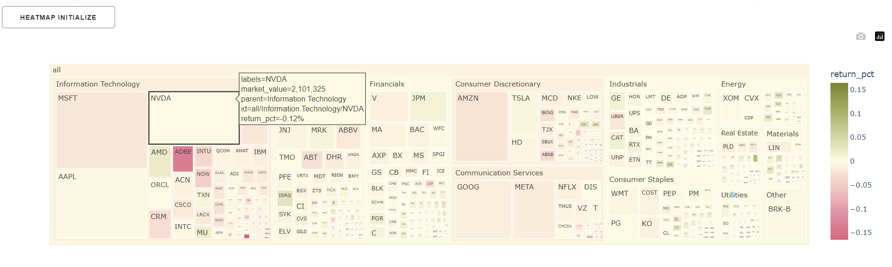
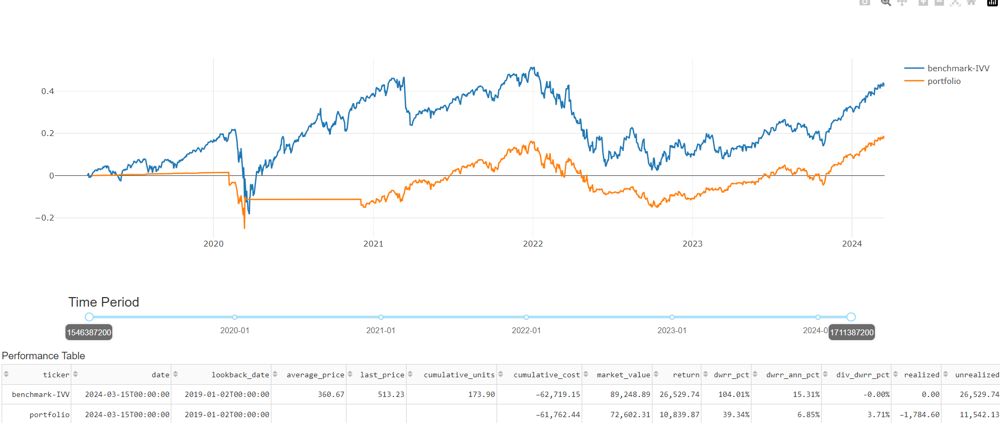
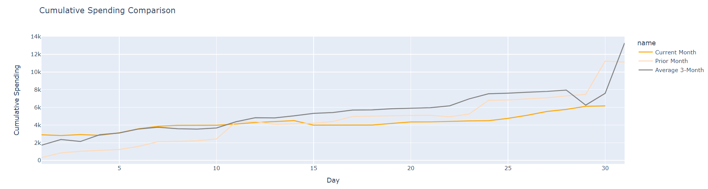

<div align="center">
  <br>
</div>

# Portfolio
Simple investment portfolio tool that will track stock and provide returns and other metrics. It also contains a web dashboard to view the data.


[](https://github.com/jkoestner/folioflex/blob/main/LICENSE.md)
[](https://codecov.io/gh/jkoestner/folioflex)
[](https://github.com/psf/black)
[](https://jkoestner.github.io/folioflex/)


## Table of Contents
- [Portfolio](#portfolio)
  - [Table of Contents](#table-of-contents)
  - [Overview](#overview)
  - [Installation](#installation)
    - [Local Install](#local-install)
    - [Docker Install](#docker-install)
  - [Usage](#usage)
    - [CLI](#cli)
    - [Python](#python)
    - [Web Dashboard - Invest](#web-dashboard---invest)
    - [Plaid Dashboard](#plaid-dashboard)
  - [Other Tools](#other-tools)
    - [Jupyter Lab Usage](#jupyter-lab-usage)
    - [Logging](#logging)
    - [Coverage](#coverage)

## Overview

**🚀 Welcome to FolioFlex! 🚀**

**📖 Description:**

- FolioFlex is your go-to toolkit for portfolio management and market analysis! Dive into the world of stocks, bonds, and more with our user-friendly tools. 📈📊

**🔧 Features:**

- **Market Screener**: Filter and find trending stocks. 🔍


- **Portfolio Management**: Organize and track, your investments. 💼

- **Budget Tool**: Create and monitor a budget. 💰



**📚 Documentation:**

- [Installation Guide](https://jkoestner.github.io/folioflex/installation.html): Get started with FolioFlex in no time! 🛠️

**🎥 See It In Action:**

- **FolioFlex Demo**: Visit a dashboard (https://koestner.fly.dev/) of FolioFlex and witness the magic! 🌟

**🔬 Jupyter Notebook:**

- [Portfolio Example](https://nbviewer.jupyter.org/github/jkoestner/folioflex/blob/main/notebook/portfolio_example.ipynb): Explore a sample portfolio and see FolioFlex in action! 📔

**🤝 Contribute:**
- Love FolioFlex? Feel free to contribute and make it even better! Every bit of help is appreciated. ❤️

Data sources:
- https://pypi.org/project/yahoo-finance/
- https://fred.stlouisfed.org/docs/api/fred/ (need an API key)
- https://finviz.com/api

Inspiration:
- https://openbb.co/

## Installation

### Local Install
To install, this repository can be installed by running the following command in 
the environment of choice.

```
pip install folioflex
```

Other options can be installed if using more functionality

```
pip install folioflex
pip install folioflex[dev]    # if needing to develop or lint
``````

Or could be done using GitHub.

```
pip install git+https://github.com/jkoestner/folioflex.git
```

If wanting to do more and develop on the code, the following command can be run to install the packages in the requirements.txt file.

```
pip install -e .
pip install -e .[dev]
```

### Docker Install
The package can also be run in docker which provides a containerized environment, and can host the web dashboard.

To run the web dashboard there are a few prerequisites.
  - Docker
  - Redis
  - Worker
  - Flower (optional)

The following can be used in a `docker-compose.yml`. 

```bash
version: "3.8"
services:
  folioflex-web:
    image: dmbymdt/folioflex:latest
    container_name: folioflex-web
    command: gunicorn -b 0.0.0.0:8001 folioflex.dashboard.app:server
    restart: unless-stopped
    environment:
      FFX_CONFIG_PATH: /code/folioflex/configs
    ports:
      - '8001:8001'
    volumes:
      - $DOCKERDIR/folioflex-web/configs:/code/folioflex/configs
```

The docker container has a configuration file that can read in environment variables or
could specify within file. 

There is also an environment variable that can specify the path to the configuration folder.

<details>
  <summary>ENVIRONMENT VARIABLES</summary>

  <table>
      <tr>
          <th>Variable</th>
          <th>Description</th>
          <th>Default</th>
      </tr>
      <tr>
          <td>FFX_CONFIG_PATH</td>
          <td>The path to the configuration folder</td>
          <td>folioflex/folioflex/configs</td>
      </tr>
  </table>
</details>

## Usage

### CLI

CLI can be used for easier commands of python scripts for both portfolio or manager. An example of a CLI command is shown below.

```commandline
ffx email --email_list "['yourname@outlook.com']" --heatmap_market {}
```

### Python

When using the portfolio class, the following code can be used to get the returns of a portfolio.

```python
from folioflex.portfolio.portfolio import Portfolio
config_path = "portfolio_demo.ini"
pf = Portfolio(
    config_path=config_path, 
    portfolio='company_a'
)
pf.get_performance()
```

### Web Dashboard - Invest

A demo of the app can be seen at https://invest.koestner.fun/.


It also can be run locally by going to the project root folder and running below.
There are a number of environment variables listed in constants to be able to run locally. 

```python
python app.py
```

### Plaid Dashboard

A separate dashboard can be run for transaction aggregation. This is a work in progress and 
will be updated as more functionality is added.

The transactions are sourced from [Plaid](https://plaid.com/). To be able to use the dashboard
there needs to be three services run:
- **plaid client**: this is the frontend
- **plaid server**: this is the backend which will query the api as well as interact with the database
- **plaid db**: this is holding the data

The [Plaid Pattern](https://github.com/plaid/pattern) repository was used as a reference
for the docker-compose setup.

```bash
  plaid-db:
    container_name: plaid-db
    image: postgres:latest
    restart: unless-stopped
    volumes:
      - $DOCKERDIR/plaid/database/init:/docker-entrypoint-initdb.d
      - $DOCKERDIR/plaid/data:/var/lib/postgresql/data
    ports:
      - $PLAID_DB_PORT:5432
    environment:
      POSTGRES_USER: postgres
      POSTGRES_PASSWORD: $PLAID_POSTGRES

  plaid-server:
    hostname: server
    container_name: plaid-server
    image: docker-plaid-server:latest
    restart: unless-stopped
    # build: $DOCKERDIR/plaid/server
    ports:
      - $PLAID_SERVER_PORT:5001
    environment:
      PLAID_CLIENT_ID: $PLAID_CLIENT_ID
      PLAID_DEVELOPMENT_REDIRECT_URI: $PLAID_DEVELOPMENT_REDIRECT_URI
      PLAID_ENV: $PLAID_ENV
      PLAID_SECRET_DEVELOPMENT: $PLAID_DEV_SECRET
      PLAID_SECRET_SANDBOX: $PLAID_SAND_SECRET
      PLAID_WEBHOOK_URL: $PLAID_WEBHOOK_URL
      PORT: $PLAID_SERVER_PORT
      DB_PORT: $PLAID_DB_PORT
      DB_HOST_NAME: plaid-db
      POSTGRES_USER: postgres
      POSTGRES_PASSWORD: $PLAID_POSTGRES
    depends_on:
      - plaid-db
      
  plaid-client:
    container_name: plaid-client
    image: docker-plaid-client:latest
    restart: unless-stopped
    # build: $DOCKERDIR/plaid/client
    ports:
      - $PLAID_PORT:3001
    environment:
      REACT_APP_PLAID_ENV: $PLAID_ENV
      REACT_APP_SERVER: $PLAID_SERVER
      DANGEROUSLY_DISABLE_HOST_CHECK: true
    depends_on:
      - plaid-server
```

## Other Tools
### Jupyter Lab Usage

To have conda environments work with Jupyter Notebooks a kernel needs to be defined. This can be done defining a kernel, shown below when
in the conda environment.

```
python -m ipykernel install --user --name=folioflex
```
### Logging

If wanting to get more detail in output of messages the logging can increased
```python
from folioflex.utils import config_helper
config_helper.set_log_level("DEBUG")
```

### Coverage

To see the test coverage the following command is run in the root directory.
```
pytest --cov=folioflex --cov-report=html
```

<hr>

[Go to Top](#table-of-contents)